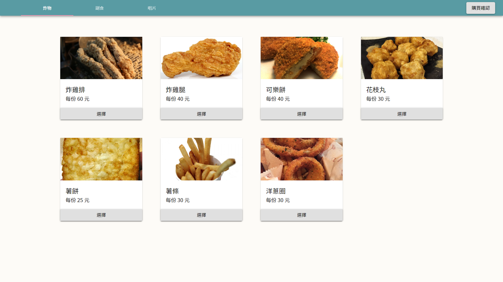
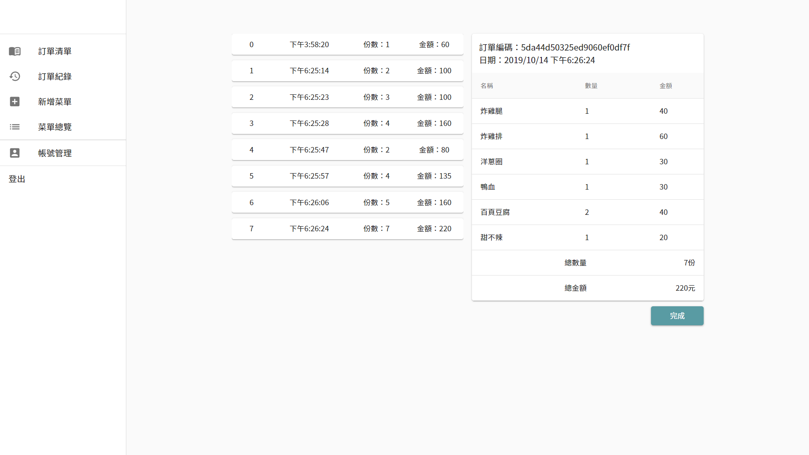

# Ordering platform

點餐系統，結合客戶點餐介面及後台菜單管理系統。 
後端程式碼[連結](https://github.com/valuejoe/ordering_plarform_server)

## 功能

### 點餐介面

-   新增商品
-   取消商品

##### 購物車選單

-   編輯商品
-   刪除商品
-   送出訂單

### 菜單管理系統

-   登入/登出
-   新增分類
-   刪除分類(分類必須為空，有菜單在分類內則無法刪除)
-   編輯分類名稱
-   新增/刪除菜單
-   編輯菜單內容(菜單名稱、金額、分類、照片)
-   未完成訂單顯示(未完成訂單一天後刪除)
-   完成訂單(存入訂單紀錄)

## 主要運用工具

### 前端

-   React
-   Redux
-   Material-ui
-   Axios

### 後端

-   Node.js
-   Express
-   Mongoose
-   Mongodb
-   Google cloud platform

## Demo

